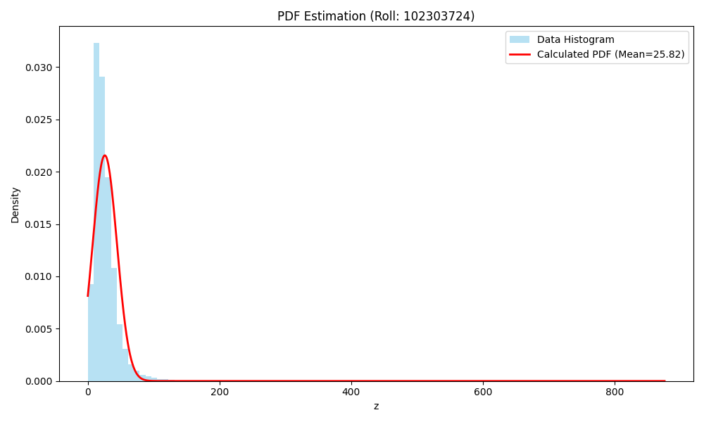

# Air Quality Analysis – PDF Parameter Estimation

## Overview
In this assignment, I analyzed air quality data, specifically focusing on Nitrogen Dioxide (NO2) levels. The main objective was to transform the raw data using a mathematical function based on my university roll number and then estimate the Probability Density Function (PDF) parameters.

## Dataset Details
- File Name: data.csv
- Feature Selected: no2 column
- Cleaning: Rows with missing values were dropped to ensure accurate calculations.

## Methodology

### 1. Data Transformation
To analyze the distribution, I transformed the original NO2 values (x) into a new variable (z) using a sinusoidal formula. The transformation parameters were derived dynamically from my unique Roll Number.

Formula:
z = x + a_r sin(b_r x)

Student Details:
- Roll Number: 102303724
- Derived Constants:
  - a_r: 0.25
  - b_r: 1.5

### 2. Parameter Estimation
After transforming the data, I calculated the Mean and Variance of the new variable z. Using these statistical measures, I computed the three required PDF parameters:
- Lambda
- Mu
- Constant (c)

## Results
The code successfully calculated the parameters. These values matched the ones I submitted in the Google Form.

- Lambda: 0.0014617052940514906
- Mu: 25.818063543032295
- c: 0.021570239817484047

## Visualization
The graph below shows the histogram of the transformed data along with the estimated PDF curve, verifying that our calculated parameters fit the data distribution well.

